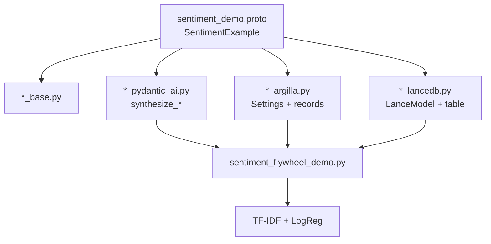
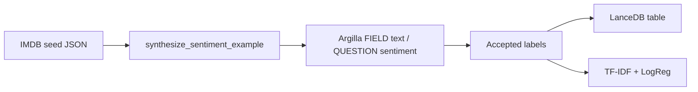

# Sentiment flywheel (IMDB → synthesize → HITL → train)

This example project builds a **binary sentiment** dataset for movie reviews and
wires it through the full py-gen-ml loop:

1. **Seed** with IMDB-style reviews (bundled JSON)
2. **Synthesize** more labeled rows with PydanticAI (`NativeOutput`) against OpenAI
3. **HITL** — push rows to Argilla (`FIELD` text / `QUESTION` sentiment) for review
4. **Persist** accepted rows to LanceDB (optional)
5. **Train** a small TF–IDF + logistic regression classifier

**One protobuf message** (`SentimentExample`) is the whole contract. Enable several
generators on that single schema and you get synthesis, HITL, and storage adapters
together—no duplicated Pydantic models per tool.





## One schema, many generators

Everything below is **one message**. The `(pgml.*).enable` options tell codegen
which adapters to emit; `(pgml.kind) = FEATURE_ROW` documents the shared role.

```protobuf
--8<-- "docs/snippets/proto/sentiment_demo.proto"
```

From that single definition, `py-gen-ml` emits (among others):

| Generated module | What you use it for |
|------------------|---------------------|
| `sentiment_demo_base.py` | Canonical Pydantic config / row model |
| `sentiment_demo_pydantic_ai.py` | Full + Partial models, `synthesize_sentiment_example(_sync)` |
| `sentiment_demo_argilla.py` | Argilla `Settings`, `to_*_record` / `from_*_record` |
| `sentiment_demo_lancedb.py` | `LanceModel`, `create_sentiment_example_table` |

Field layout for this walkthrough:

| Field | Use | Argilla slot |
|-------|-----|--------------|
| `id` | Stable row id | `METADATA` |
| `source` | `imdb` or `synthetic` | `METADATA` |
| `text` | Review body (classifier input) | `FIELD` |
| `sentiment` | `negative` / `positive` | `QUESTION` |

Proto **leading comments** on `text` / `sentiment` become
`Field(description=...)` and thus JSON Schema descriptions for synthesis.
Keep them specific—vague comments produce weaker synthetic data
(see [PydanticAI](../guides/pydantic_ai.md)).

Enable the generators when you regenerate:

```console
py-gen-ml path/to/sentiment_demo.proto \
  --generators=base,patch,sweep,cli_args,pydantic_ai,argilla,lancedb
```

## Setup

From the docs snippets project:

```console
cd docs/snippets
uv sync --extra bridges --extra pydantic-ai --extra argilla --extra lancedb
bash regenerate.sh   # regenerates all snippet protos, including sentiment_demo
```

### OpenAI credentials (required)

The demo talks to OpenAI (Azure OpenAI–compatible endpoint) via PydanticAI.
Export all four:

```console
export OPENAI_API_KEY=...
export OPENAI_ENDPOINT=https://YOUR_RESOURCE.openai.azure.com/
export OPENAI_MODEL=gpt-4o
export OPENAI_API_VERSION=2024-12-01-preview
```

| Variable | Meaning |
|----------|---------|
| `OPENAI_API_KEY` | API key |
| `OPENAI_ENDPOINT` | Azure OpenAI resource endpoint (or compatible base URL) |
| `OPENAI_MODEL` | Deployment / model name passed to `OpenAIChatModel` |
| `OPENAI_API_VERSION` | Azure API version (e.g. `2024-12-01-preview`) |

### Argilla credentials (required to push HITL records)

```console
export ARGILLA_API_URL=https://...
export ARGILLA_API_KEY=...
```

Seed file (short IMDB-style reviews checked into the repo):

```text
docs/snippets/data/imdb_sentiment_seeds.json
```

These are **not** the full Stanford IMDB corpus—they are compact, realistic
reviews shaped like IMDB user text so the demo stays fast and license-friendly.
Swap in your own seeds (same JSON shape) without changing the proto.

## Run the demo

```python linenums="1"
--8<-- "docs/snippets/src/snippets/sentiment_flywheel_demo.py"
```

```console
cd docs/snippets
uv run python -m snippets.sentiment_flywheel_demo
```

Example output shape:

```json
{
  "n_seeds": 8,
  "n_synthetic": 8,
  "n_labeled": 16,
  "n_argilla_records": 16,
  "n_settings_fields": 1,
  "n_settings_questions": 1,
  "argilla_dataset": "imdb_sentiment",
  "openai_model": "gpt-4o",
  "lancedb_table": "sentiment_examples",
  "train_accuracy": 0.75,
  "n_train": 12,
  "n_test": 4
}
```

Accuracy on this tiny toy set is **not** meaningful; the point is the wiring
from seed → synth → HITL records → store → train.

## Step-by-step

### 1. Load IMDB seeds

```python
from snippets.sentiment_flywheel_demo import load_imdb_seeds

seeds = load_imdb_seeds()
assert seeds[0].source == "imdb"
assert seeds[0].sentiment in {"positive", "negative"}
```

Seeds validate as generated `SentimentExample` (full) models.

### 2. Synthesize with few-shot + diversify

```python
from snippets.sentiment_flywheel_demo import SYSTEM_PROMPT, openai_model_from_env
from pgml_out.sentiment_demo_pydantic_ai import (
    SentimentExamplePartial,
    synthesize_sentiment_example_sync,
)

synthetic = synthesize_sentiment_example_sync(
    model=openai_model_from_env(),
    system_prompt=SYSTEM_PROMPT,
    count=4,
    examples=[SentimentExamplePartial.model_validate(s.model_dump()) for s in seeds],
    diversify_rounds=1,
)
```

IMDB seeds are passed as few-shot `examples`. The system prompt asks for
IMDB-style reviews with `source="synthetic"`.

`diversify_rounds=1` means: generate a first batch of `count` rows, then run
another round that feeds prior full outputs back as examples. Total synthetic
rows ≈ `count * (diversify_rounds + 1)`.

### 3. HITL via Argilla

```python
from snippets.sentiment_flywheel_demo import argilla_client_from_env, push_argilla_dataset
from pgml_out.sentiment_demo_argilla import (
    build_sentiment_example_settings,
    to_sentiment_example_record,
)
from py_gen_ml.bridges import synthetic_rows_to_argilla_records

client = argilla_client_from_env()
settings = build_sentiment_example_settings(client=client)
records = synthetic_rows_to_argilla_records(
    seeds + synthetic,
    to_record=to_sentiment_example_record,
)
dataset = push_argilla_dataset(client=client, settings=settings, records=records)
assert {f.name for f in settings.fields} == {"text"}
assert {q.name for q in settings.questions} == {"sentiment"}
```

Annotators confirm or correct `sentiment` in the Argilla UI. Labels are logged as
**suggestions** first; prefer human **responses** for training once review is done.

### 4. Store in LanceDB

`run_flywheel(use_lancedb=True)` writes labeled rows to a temp LanceDB using the
generated `SentimentExample` LanceModel and
`py_gen_ml.bridges.append_feature_rows`.

In production, keep a durable URI and append only after HITL acceptance.

### 5. Train

`train_sentiment_classifier` fits `TfidfVectorizer` + `LogisticRegression` and
reports holdout accuracy. Swap this for your real training stack; the dataset
contract stays the same protobuf message.

Typical next steps:

- Load accepted rows from LanceDB (`load_seeds_from_table`) or Argilla exports
- Filter `source` / quality metadata
- Train / evaluate / push a new serving model
- Log production predictions back into Argilla
  ([bridges.serving_argilla](../guides/bridges.md))

## Completing partial reviews

If you have review text without labels (or the reverse), use Path B
(`incomplete`):

```python
from snippets.sentiment_flywheel_demo import openai_model_from_env
from pgml_out.sentiment_demo_pydantic_ai import (
    SentimentExamplePartial,
    synthesize_sentiment_example_sync,
)

filled = synthesize_sentiment_example_sync(
    model=openai_model_from_env(),
    system_prompt="Fill only missing fields for sentiment examples.",
    incomplete=[
        SentimentExamplePartial(
            id="need-label-1",
            source="imdb",
            text="An absolute masterpiece of modern cinema.",
            sentiment=None,
        ),
    ],
)
```

Only `sentiment` is sent in the gap JSON Schema; provided fields are preserved.
Do not combine `incomplete` with `diversify_rounds > 0` in one call (v1).

## Production checklist

- [ ] Field comments on every synthesis-relevant field
- [ ] Explicit Argilla `slot` on every field (`FIELD` / `QUESTION` / `METADATA`)
- [ ] Seed set balanced enough for few-shot (both classes)
- [ ] `OPENAI_API_KEY` / `OPENAI_ENDPOINT` / `OPENAI_MODEL` / `OPENAI_API_VERSION` set
- [ ] HITL: train on human responses, not only LLM suggestions
- [ ] Track `source` / `id` in metadata for auditability

## See also

- [PydanticAI synthesis](../guides/pydantic_ai.md)
- [Argilla datasets](../guides/argilla.md)
- [Cross-tool bridges](../guides/bridges.md)
- [LanceDB schemas](../guides/lancedb.md)
- [Message kinds](../guides/message_kinds.md)
