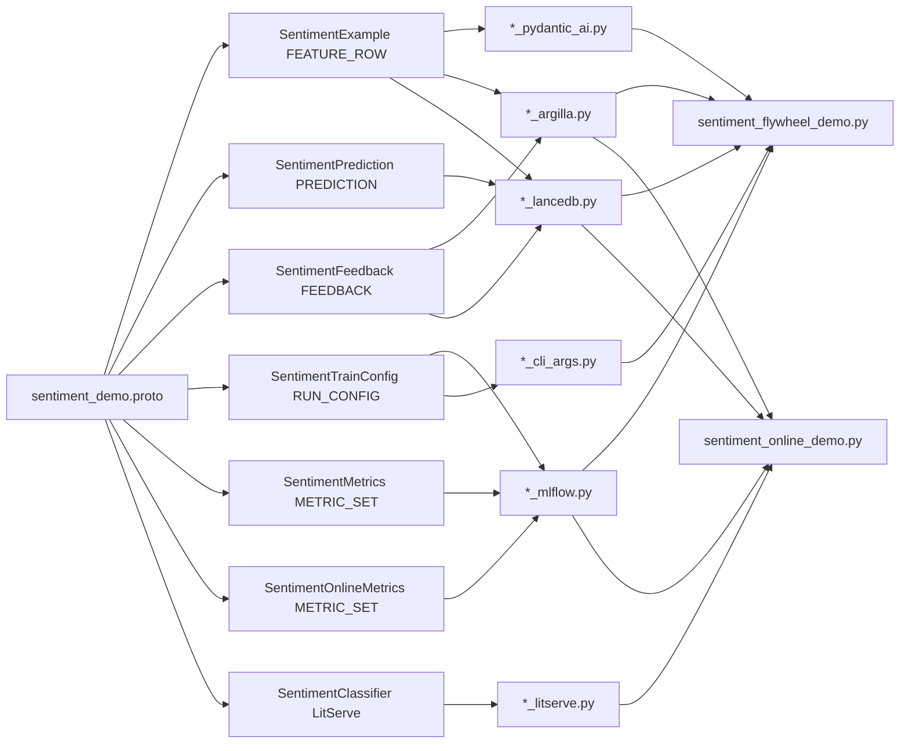
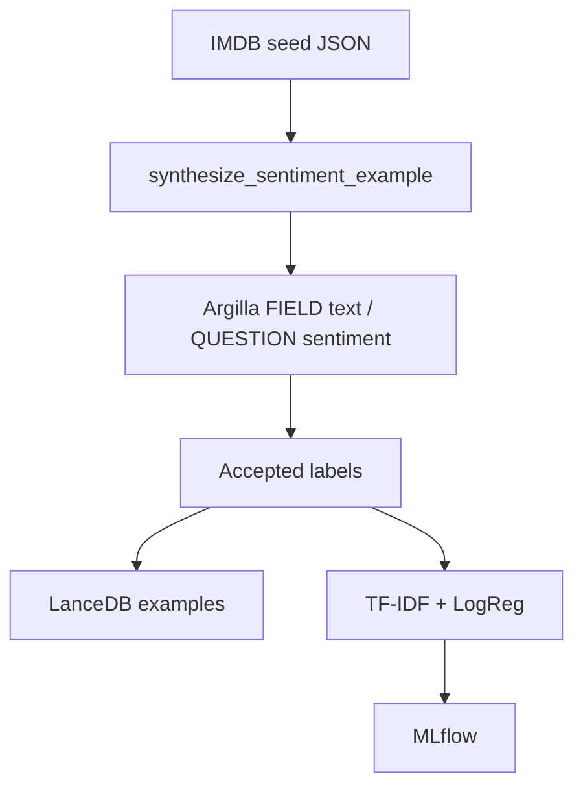
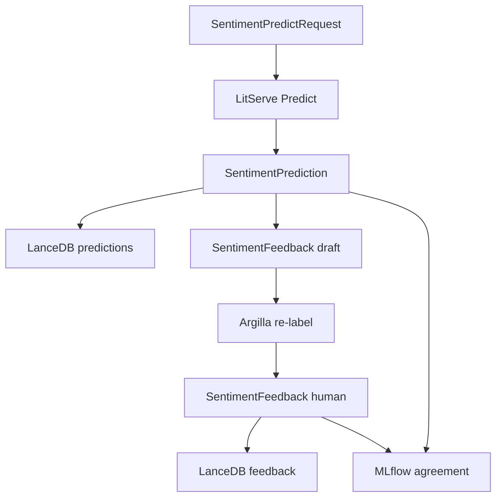

# Sentiment flywheel (IMDB → synthesize → HITL → train → online)

This example project builds a **binary sentiment** dataset for movie reviews and
wires it through the full py-gen-ml loop:

**Offline (train-time)**

1. **Seed** with IMDB-style reviews (bundled JSON)
2. **Synthesize** more labeled rows with PydanticAI (`NativeOutput`) against OpenAI
3. **HITL** — push rows to Argilla (`FIELD` text / `QUESTION` sentiment) for review
4. **Persist** accepted rows to LanceDB (optional)
5. **Train** a small TF–IDF + logistic regression classifier
6. **Track** the run with MLflow

**Online (serve-time)**

7. **Serve** scored reviews via LitServe (`SentimentPredictRequest` → `SentimentPrediction`)
8. **Store** predictions in LanceDB (separate table from labeled examples)
9. **Re-label** via Argilla on `SentimentFeedback` (predicted label as suggestion)
10. **Store** feedback rows and **track** agreement with MLflow

**One protobuf file** defines the contracts: labeled `SentimentExample`,
serve I/O, separate `SentimentPrediction` / `SentimentFeedback`, plus train and
online metrics. Enable several generators and you get adapters together—no
duplicated schemas per tool.







## One schema file, many generators

```protobuf
--8<-- "docs/snippets/proto/sentiment_demo.proto"
```

| Generated module | What you use it for |
|------------------|---------------------|
| `sentiment_demo_base.py` | Canonical Pydantic / YAML models |
| `sentiment_demo_cli_args.py` | Generated Typer CLI flags for `SentimentTrainConfig` |
| `sentiment_demo_pydantic_ai.py` | Full + Partial models, `synthesize_sentiment_example(_sync)` |
| `sentiment_demo_argilla.py` | Argilla `Settings` for examples **and** feedback |
| `sentiment_demo_lancedb.py` | LanceModels for examples, predictions, feedback |
| `sentiment_demo_litserve.py` | `create_sentiment_classifier_server`, predict client |
| `sentiment_demo_mlflow.py` | Train + online metric helpers |

`SentimentExample` field layout (offline HITL):

| Field | Use | Argilla slot |
|-------|-----|--------------|
| `id` | Stable row id | `METADATA` |
| `source` | `imdb` or `synthetic` | `METADATA` |
| `text` | Review body (classifier input) | `FIELD` |
| `sentiment` | `negative` / `positive` | `QUESTION` |

Online contracts (separate messages — do not overload `SentimentExample`):

| Message | Kind | Notable fields |
|---------|------|----------------|
| `SentimentPredictRequest` | `FEATURE_ROW` | `id`, `text` (RPC input) |
| `SentimentPrediction` | `PREDICTION` | `sample_id`, `text`, `sentiment`, `score`, `model_version` |
| `SentimentFeedback` | `FEEDBACK` | `sample_id`, `text` (FIELD), `predicted_sentiment` (METADATA), `sentiment` (QUESTION), `source` |
| `SentimentServeConfig` | `RUN_CONFIG` | LitServe URL / workers / accelerator |
| `SentimentOnlineMetrics` | `METRIC_SET` | `n_predictions`, `n_feedback`, `agreement_rate` |

Tracking messages use shared `(pgml.tracking_field)` slots (see
[MLflow](../guides/mlflow.md)):

| Message | Kind | Notable fields |
|---------|------|----------------|
| `SentimentTrainConfig` | `RUN_CONFIG` | `run_name` (TAG), `synthesize_count`, `diversify_rounds`, `openai_model`, `test_size` (PARAM) |
| `SentimentMetrics` | `METRIC_SET` | `accuracy`, `n_train`, `n_test`, `n_labeled` |

Proto **leading comments** on `text` / `sentiment` become
`Field(description=...)` and thus JSON Schema descriptions for synthesis.
Keep them specific—vague comments produce weaker synthetic data
(see [PydanticAI](../guides/pydantic_ai.md)).

Enable the generators when you regenerate:

```console
py-gen-ml path/to/sentiment_demo.proto \
  --generators=base,patch,sweep,cli_args,pydantic_ai,argilla,lancedb,litserve,mlflow
```

## Setup

From the docs snippets project:

```console
cd docs/snippets
uv sync --extra bridges --extra pydantic-ai --extra argilla --extra lancedb --extra litserve --extra mlflow
bash regenerate.sh   # regenerates all snippet protos, including sentiment_demo
```

### OpenAI credentials (required)

The demo talks to OpenAI (Azure OpenAI–compatible endpoint) via PydanticAI.
Export:

```console
export OPENAI_API_KEY=...
export OPENAI_ENDPOINT=https://YOUR_RESOURCE.openai.azure.com/
export OPENAI_API_VERSION=2024-12-01-preview
```

| Variable | Meaning |
|----------|---------|
| `OPENAI_API_KEY` | API key |
| `OPENAI_ENDPOINT` | Azure OpenAI resource endpoint (or compatible base URL) |
| `OPENAI_API_VERSION` | Azure API version (e.g. `2024-12-01-preview`) |

The deployment / model name is **`SentimentTrainConfig.openai_model`** (YAML default
`gpt-4o`, overridable with `--openai-model`).

### Argilla credentials (required to push HITL records)

```console
export ARGILLA_API_URL=https://...
export ARGILLA_API_KEY=...
```

MLflow uses its normal env / local tracking URI (no cloud account required for a
file store).

Seed file (short IMDB-style reviews checked into the repo):

```text
docs/snippets/data/imdb_sentiment_seeds.json
```

These are **not** the full Stanford IMDB corpus—they are compact, realistic
reviews shaped like IMDB user text so the demo stays fast and license-friendly.
Swap in your own seeds (same JSON shape) without changing the proto.

## Run the demo

`SentimentTrainConfig` is populated like CIFAR: YAML base config + generated CLI
overrides via `@pgml.pgml_cmd` / `apply_cli_args`.

Default YAML:

```yaml
--8<-- "docs/snippets/configs/base/sentiment_train_config.yaml"
```

```python linenums="1"
--8<-- "docs/snippets/src/snippets/sentiment_flywheel_demo.py"
```

```console
cd docs/snippets
uv run python -m snippets.sentiment_flywheel_demo \
  --config-paths configs/base/sentiment_train_config.yaml

# override any train-config field:
uv run python -m snippets.sentiment_flywheel_demo \
  --config-paths configs/base/sentiment_train_config.yaml \
  --synthesize-count 2 --run-name my-run
```

Example output shape:

```json
{
  "n_seeds": 8,
  "n_synthetic": 8,
  "n_labeled": 16,
  "n_argilla_records": 16,
  "n_settings_fields": 1,
  "n_settings_questions": 1,
  "argilla_dataset": "imdb_sentiment",
  "openai_model": "gpt-4o",
  "run_name": "sentiment",
  "lancedb_table": "sentiment_examples",
  "train_accuracy": 0.75,
  "n_train": 12,
  "n_test": 4,
  "mlflow_experiment": "imdb_sentiment"
}
```

Accuracy on this tiny toy set is **not** meaningful; the point is the wiring
from seed → synth → HITL records → store → train → track.

## Step-by-step

### 1. Load IMDB seeds

```python
from snippets.sentiment_flywheel_demo import load_imdb_seeds

seeds = load_imdb_seeds()
assert seeds[0].source == "imdb"
assert seeds[0].sentiment in {"positive", "negative"}
```

Seeds validate as generated `SentimentExample` (full) models.

### 2. Synthesize with few-shot + diversify

```python
from snippets.sentiment_flywheel_demo import SYSTEM_PROMPT, openai_model_from_env
from pgml_out.sentiment_demo_base import SentimentTrainConfig
from pgml_out.sentiment_demo_pydantic_ai import (
    SentimentExamplePartial,
    synthesize_sentiment_example_sync,
)

train_config = SentimentTrainConfig.from_yaml_files(
    ["configs/base/sentiment_train_config.yaml"]
)
synthetic = synthesize_sentiment_example_sync(
    model=openai_model_from_env(model=train_config.openai_model),
    system_prompt=SYSTEM_PROMPT,
    count=train_config.synthesize_count,
    examples=[SentimentExamplePartial.model_validate(s.model_dump()) for s in seeds],
    diversify_rounds=train_config.diversify_rounds,
)
```

IMDB seeds are passed as few-shot `examples`. The system prompt asks for
IMDB-style reviews with `source="synthetic"`.

`diversify_rounds=1` means: generate a first batch of `count` rows, then run
another round that feeds prior full outputs back as examples. Total synthetic
rows ≈ `count * (diversify_rounds + 1)`.

### 3. HITL via Argilla

```python
from snippets.sentiment_flywheel_demo import argilla_client_from_env, push_argilla_dataset
from pgml_out.sentiment_demo_argilla import (
    build_sentiment_example_settings,
    to_sentiment_example_record,
)
from py_gen_ml.bridges import synthetic_rows_to_argilla_records

client = argilla_client_from_env()
settings = build_sentiment_example_settings(client=client)
records = synthetic_rows_to_argilla_records(
    seeds + synthetic,
    to_record=to_sentiment_example_record,
)
dataset = push_argilla_dataset(client=client, settings=settings, records=records)
assert {f.name for f in settings.fields} == {"text"}
assert {q.name for q in settings.questions} == {"sentiment"}
```

Annotators confirm or correct `sentiment` in the Argilla UI. Labels are logged as
**suggestions** first; prefer human **responses** for training once review is done.

### 4. Store in LanceDB

`run_flywheel(train_config, use_lancedb=True)` writes labeled rows to a temp LanceDB using the
generated `SentimentExample` LanceModel and
`py_gen_ml.bridges.append_feature_rows`.

In production, keep a durable URI and append only after HITL acceptance.

### 5. Train

`train_sentiment_classifier` fits `TfidfVectorizer` + `LogisticRegression` and
reports holdout accuracy. Swap this for your real training stack; the dataset
contract stays the same protobuf message.

### 6. Track with MLflow

`run_flywheel` logs the same `SentimentTrainConfig` instance that drove synthesis
and training (from YAML + CLI), plus `SentimentMetrics`:

```python
from snippets.sentiment_flywheel_demo import log_training_to_mlflow
from pgml_out.sentiment_demo_base import SentimentTrainConfig
from pgml_out.sentiment_demo_mlflow import SentimentMetrics

config = SentimentTrainConfig.from_yaml_files(
    ["configs/base/sentiment_train_config.yaml"]
)
metrics = SentimentMetrics(accuracy=0.75, n_train=12, n_test=4, n_labeled=16)
log_training_to_mlflow(train_config=config, metrics=metrics)
```

Typical next steps after offline training:

- Load accepted rows from LanceDB (`load_seeds_from_table`) or Argilla exports
- Filter `source` / quality metadata
- Train / evaluate / push a serving model (see **Online loop** below)

## Online loop

After you have a classifier, the same proto drives serve → prediction → feedback.

```console
cd docs/snippets
uv run python -m snippets.sentiment_online_demo score-batch
# live server (writes predictions to ./sentiment_online.lancedb):
uv run python -m snippets.sentiment_online_demo serve --port 8000
```

```python linenums="1"
--8<-- "docs/snippets/src/snippets/sentiment_online_demo.py"
```

Flow:

1. Fit TF–IDF + LogReg on IMDB seeds (same helper as the offline demo).
2. Score each seed as `SentimentPredictRequest` → `SentimentPrediction`.
3. Persist predictions with `append_rows` to the `sentiment_predictions` table.
4. Merge request + prediction into a `SentimentFeedback` draft (`source=model`);
   Argilla gets the predicted label as a **Suggestion** on the QUESTION field.
5. Simulate (or apply) human corrections → `source=human` feedback rows in
   `sentiment_feedback`.
6. Log `SentimentOnlineMetrics` (`n_predictions`, `n_feedback`, `agreement_rate`)
   to MLflow experiment `imdb_sentiment_online`.

`SentimentPrediction` and `SentimentFeedback` are **separate messages** from
`SentimentExample`. Do not overload the labeled training row for prod scores.

See also [LitServe](../guides/litserve.md) and
[bridges.serving_argilla](../guides/bridges.md).

## Completing partial reviews

If you have review text without labels (or the reverse), use Path B
(`incomplete`):

```python
from snippets.sentiment_flywheel_demo import openai_model_from_env
from pgml_out.sentiment_demo_pydantic_ai import (
    SentimentExamplePartial,
    synthesize_sentiment_example_sync,
)

filled = synthesize_sentiment_example_sync(
    model=openai_model_from_env(model="gpt-4o"),
    system_prompt="Fill only missing fields for sentiment examples.",
    incomplete=[
        SentimentExamplePartial(
            id="need-label-1",
            source="imdb",
            text="An absolute masterpiece of modern cinema.",
            sentiment=None,
        ),
    ],
)
```

Only `sentiment` is sent in the gap JSON Schema; provided fields are preserved.
Do not combine `incomplete` with `diversify_rounds > 0` in one call (v1).

## Production checklist

- [ ] Field comments on every synthesis-relevant field
- [ ] Explicit Argilla `slot` on every field (`FIELD` / `QUESTION` / `METADATA`)
- [ ] Seed set balanced enough for few-shot (both classes)
- [ ] `OPENAI_API_KEY` / `OPENAI_ENDPOINT` / `OPENAI_API_VERSION` set (offline synth)
- [ ] HITL: train on human responses, not only LLM suggestions
- [ ] Track `source` / `id` in metadata for auditability
- [ ] Keep predictions and feedback in separate LanceDB tables from labeled examples
- [ ] MLflow tracking URI configured for real runs

## See also

- [PydanticAI synthesis](../guides/pydantic_ai.md)
- [Argilla datasets](../guides/argilla.md)
- [MLflow tracking](../guides/mlflow.md)
- [LitServe services](../guides/litserve.md)
- [Cross-tool bridges](../guides/bridges.md)
- [LanceDB schemas](../guides/lancedb.md)
- [Message kinds](../guides/message_kinds.md)
