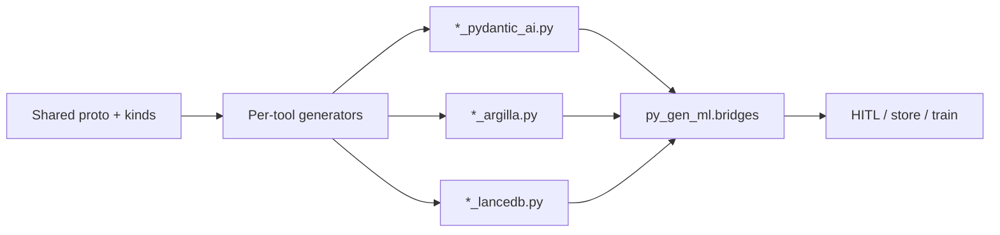

# Cross-tool bridges

`py_gen_ml.bridges` is a **runtime** package: small typed helpers that compose
**already generated** adapters (PydanticAI, Argilla, LanceDB, serving) without a
separate GeneratorSpec.

Generators stay single-tool (`(pgml.pydantic_ai)`, `(pgml.argilla)`,
`(pgml.lancedb)`, …). Bridges accept callables like generated
`to_*_record` / Lance models so they stay schema-agnostic.

## Install

```console
pip install 'py-gen-ml[bridges]'
```

This pulls the common extras (`pydantic-ai`, `argilla`, `datasets`, `lancedb`,
`scikit-learn`). You can still install only the tools you need and import the
bridge modules that apply.

```console
uv add 'py-gen-ml[bridges]'
```

## Mental model



| Module | Responsibility |
|--------|----------------|
| `bridges.synthesis_argilla` | Map synthesized rows → Argilla records via `to_record` |
| `bridges.lancedb_rows` | `append_feature_rows`, `load_seeds_from_table` |
| `bridges.serving_argilla` | Serving request/response → review record |
| `bridges.flywheel` | Thin `seeds_to_dicts` / `annotated_rows_to_dicts` helpers |

Public re-exports live in `py_gen_ml.bridges` (`__all__`).

## Synthesis → Argilla

After PydanticAI (or any source) yields full models, turn them into Argilla
records with the **generated** mapper:

```python
from py_gen_ml.bridges import synthetic_rows_to_argilla_records
from pgml_out.sentiment_demo_argilla import to_sentiment_example_record

records = synthetic_rows_to_argilla_records(
    rows,
    to_record=to_sentiment_example_record,
)
```

`synthetic_rows_to_argilla_records` is intentionally thin—it only maps. Create
the dataset, choose workspace, and call `dataset.records.log` in *your* code
(see [Argilla](argilla.md)).

Optional helper:

```python
from py_gen_ml.bridges.synthesis_argilla import log_records

log_records(dataset, records)
```

## LanceDB persistence

```python
import lancedb
from py_gen_ml.bridges import append_feature_rows, load_seeds_from_table
from pgml_out.sentiment_demo_lancedb import (
    SentimentExample,
    create_sentiment_example_table,
)

db = lancedb.connect("./sentiment.lancedb")
table = create_sentiment_example_table(db)
append_feature_rows(
    table,
    [SentimentExample.model_validate(r.model_dump()) for r in rows],
)

# Later: reload for training or few-shot seeds
seeds = load_seeds_from_table(table, model_cls=SentimentExample, limit=100)
```

`append_feature_rows` calls `table.add(...)` with `model_dump()` when available.
`load_seeds_from_table` uses `table.to_pandas()` then `model_cls.model_validate`.

## Serving → HITL

When a live model predicts, log the pair for review:

```python
from py_gen_ml.bridges import log_prediction_for_review

record = log_prediction_for_review(
    request,
    response,
    merge=lambda req, resp: merge_into_sentiment_example(req, resp),
    to_record=to_sentiment_example_record,
    log=dataset.records.log,  # optional
)
```

`merge` is application-specific (e.g. request text + predicted label →
`SentimentExample`). The bridge does not know your request/response shapes.

## Flywheel dict helpers

For JSON dumps, configs, or non-Pydantic sinks:

```python
from py_gen_ml.bridges import seeds_to_dicts, annotated_rows_to_dicts

payload = seeds_to_dicts(rows)  # uses model_dump(mode="json") when present
# annotated_rows_to_dicts is an alias with the same behavior
```

Pass `dump=` to customize serialization.

## End-to-end walkthrough

For a concrete IMDB-seeded sentiment pipeline (synthesize → Argilla Settings →
LanceDB → train), see the [Sentiment flywheel](../example_projects/sentiment_flywheel.md)
example project. It includes a CI-validated demo module under `docs/snippets`.

## Design rules

- Prefer **kinds** for shared roles; prefer **tool opts** for emission.
- Bridges should not re-emit Pydantic bodies—call generated mappers.
- Keep optional SDKs behind extras; bridge unit tests use fakes / dicts.
- Do not put multi-tool glue inside a GeneratorSpec—keep generators single-tool.

## See also

- [PydanticAI synthesis](pydantic_ai.md)
- [Argilla datasets](argilla.md)
- [LanceDB schemas](lancedb.md)
- [Sentiment flywheel](../example_projects/sentiment_flywheel.md)
- [Message kinds](message_kinds.md)
