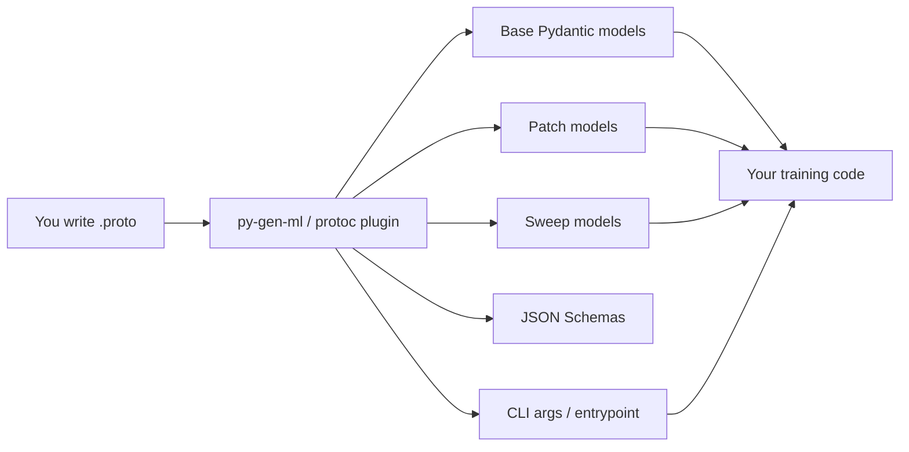

---
hide:
  - navigation
  - toc
---

<div align="center">
  
  
  <h1>py-gen-ml</h1>
  <p>Typed ML configuration tooling, generated from Protocol Buffer schemas.</p>
</div>


## 🌟 Project Introduction

`py-gen-ml` simplifies the configuration and management of machine learning projects. You define your config schema in [Protocol Buffers](https://protobuf.dev/) (protobufs). A deterministic `protoc` plugin then generates strongly typed Pydantic models, JSON Schemas, patch and sweep types, and optional Typer CLIs. The schema you write is the single source of truth from which the rest of the config tooling is derived.

## 🧭 What this is (and isn't)

**What this is:**

- You author `.proto` files that describe your ML configuration.
- You run `py-gen-ml`, which invokes the `protoc-gen-py-ml` plugin. That is ordinary schema-driven code generation.
- From that schema you get base configs, patches, sweeps, JSON Schemas for YAML validation, CLI parsers, and optional factories.

**What this isn't:**

- Not an LLM. Nothing here invents schemas, protobufs, or training code from a prompt.
- Not “AI generates your protobufs.” The direction is the opposite: **protobuf → ML config tooling**.

## 🔄 How it fits together



| Artifact | What it's for |
|----------|----------------|
| Base models | Load and validate full YAML configs |
| Patch models | Overlay small experiment deltas on a base |
| Sweep models | Define Optuna search spaces in YAML |
| JSON Schemas | Validate YAML as you type in the IDE |
| CLI / entrypoint | Override nested fields from the command line |
| Factories | Optional `build()` helpers from `(pgml.factory)` |

## ✨ Brief Overview

A real quick overview of what you can do with `py-gen-ml`:

<div class="grid cards" markdown>

-   :material-code-block-braces:{ .lg .middle } __Define protos__

    ---

    ```proto
    --8<-- "docs/snippets/proto/quickstart_b.proto:8:17"
    ```

-   :material-creation-outline:{ .lg .middle } __Generated Base Model__

    ---

    ```py
    --8<-- "docs/snippets/src/pgml_out/quickstart_b_base.py:5:15"
    ```

-   :material-creation-outline:{ .lg .middle } __Generated Patch Config__

    ---

    ```py
    --8<-- "docs/snippets/src/pgml_out/quickstart_b_patch.py:5:19"
    ```

    ---

-   :material-creation-outline:{ .lg .middle } __Generated Sweep Config__

    ---

    ```py
    --8<-- "docs/snippets/src/pgml_out/quickstart_b_sweep.py:9:19"
    ```

    ---


-   :material-creation-outline:{ .lg .middle } __Generated CLI Parser__

    ---

    ```py
    --8<-- "docs/snippets/src/pgml_out/quickstart_b_cli_args.py:11:28"
    # Remaining code...
    ```

-   :material-creation-outline:{ .lg .middle } __Generated Entrypoint__

    ---

    ```py
    --8<-- "docs/snippets/src/pgml_out/mlp_quickstart_entrypoint.py:22:35"
        # Remaining code....
    ```

-   :material-arm-flex-outline:{ .lg .middle } __Flexible YAML Config__

    ---

    ```yaml
    # base.yaml
    layers:
    - num_units: 100
      activation: "#/_defs/activation"
    - num_units: 50
      activation: "#/_defs/activation"
    optimizer:
      type: adamw
      learning_rate: 1e-4
      schedule: '!cosine_schedule.yaml'
    _defs_:
      activation: relu
    ```

    ```yaml
    # cosine_schedule.yaml
    min_lr: 1e-5
    max_lr: 1e-3
    ```

-   :material-arm-flex-outline:{ .lg .middle } __Flexible YAML sweeps__

    ---

    ```yaml
    layers:
    - num_units:  # Sample from a list
      - 100
      - 50
      activation: "#/_defs/activation"
    - num_units:  # Sample from a range
        low: 10
        high: 100
        step: 10
      activation: "#/_defs/activation"
    _defs_:
      activation: relu
    ```


-   :material-arm-flex-outline:{ .lg .middle } __Instant YAML validation w/ JSON schemas__

    ---

    


</div>


## 🔑 Key Features

**📌 Single Source of Truth**:

- The Protobuf schema provides a centralized definition for your configurations.

**🔧 Flexible Configuration Management**:

- **Minimal Change Amplification**: Automatically generated code reduces cascading manual changes when modifying configurations.
- **Flexible Patching**: Easily modify base configurations with patches for quick experimentation.
- **Flexible YAML**: Use human-readable YAML with support for advanced references within and across files.
- **Hyperparameter Sweeps**: Effortlessly define and manage hyperparameter tuning.
- **CLI Argument Parsing**: Automatically generate command-line interfaces from your configuration schemas.
- **Factories**: Optionally generate `build()` helpers that instantiate Python classes from config fields.

**✅ Validation and Type Safety**:

- **JSON Schema Generation**: Easily validate your YAML content as you type.
- **Strong Typing**: The generated code comes with strong typing that will help you, your IDE, the type checker and your team to better understand the codebase and to build more robust ML code.

## 🚦 Getting Started

To start using py-gen-ml, you can install it via pip:

```console
pip install py-gen-ml
```

For a quick example of how to use py-gen-ml in your project, check out our [Quick Start Guide](quickstart.md).

## 💡 Motivation

Machine learning projects often involve complex configurations with many interdependent parameters. Changing one config (e.g., the dataset) might require adjusting several other parameters for optimal performance. Traditional approaches to organizing configs can become unwieldy and tightly coupled with code, making changes difficult.

`py-gen-ml` addresses these challenges by:

1. 📊 Providing a single, strongly-typed schema definition for configurations. You write that schema in protobuf.
2. 🔄 Generating deterministic code to manage configuration changes automatically (base, patch, sweep, CLI).
3. 📝 Offering flexible YAML configurations with advanced referencing and variable support.
4. 🛠️ Generating JSON schemas for real-time YAML validation.
5. 🔌 Seamlessly integrating into your workflow with multiple experiment running options:
   - Single experiments with specific config values
   - Base config patching
   - Parameter sweeps via JSON schema validated YAML files
   - Quick value overrides via a generated CLI parser
   - Arbitrary combinations of the above options

This approach results in more robust ML code, leveraging strong typing and IDE support while avoiding the burden of change amplification in complex configuration structures.

## 🎯 When to use `py-gen-ml`

Consider using `py-gen-ml` when you need to:

- 📈 Manage complex ML projects more efficiently
- 🔬 Streamline experiment running and hyperparameter tuning
- 🛡️ Reduce the impact of configuration changes on your workflow
- 💻 Leverage type safety and IDE support in your ML workflows

## 📚 Where to go from here

- [Quickstart](quickstart.md): Write a proto, generate models, load YAML, patch, sweep, and run a CLI.
- [py-gen-ml command](py-gen-ml-command.md): Flags, outputs, and project layout.
- [Protobuf crash course](guides/protobuf.md): How schemas map to generated tooling.
- [YAML configuration](guides/defining_yaml_files.md): Human-readable configs with JSON Schema validation.
- [Patching](guides/patching.md): Express experiments as deltas on a base config.
- [Parameter Sweeps](guides/sweep.md): Optuna search spaces from generated sweep models.
- [CLI argument parsing](guides/cli_argument_parsing.md): Override nested fields from the command line.
- [Factories](guides/builders.md): Generate `build()` helpers from `(pgml.factory)`.
- [CIFAR-10 example](example_projects/cifar10.md): An end-to-end training project using `py-gen-ml`.
- [Sentiment flywheel](example_projects/sentiment_flywheel.md): Synthesize IMDB-style reviews, review in Argilla, train a classifier.
