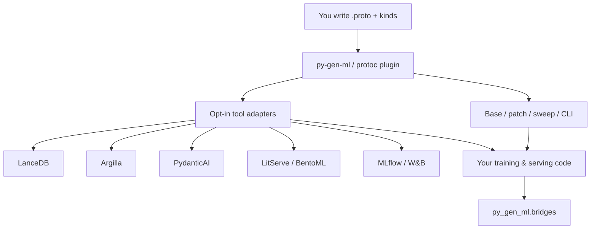
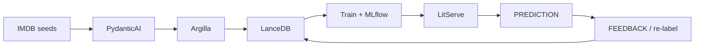

---
hide:
  - navigation
  - toc
---

<div align="center">
  

  <h1>py-gen-ml</h1>
  <p>Typed ML contracts from Protocol Buffers—across the whole lifecycle.</p>
</div>

## Project introduction

`py-gen-ml` turns **your** protobuf schemas into typed adapters for the ML
lifecycle: feature rows, labels, predictions, feedback, run configs, and metrics.
A deterministic `protoc` plugin emits Pydantic models and optional tool adapters
(LanceDB, Argilla, PydanticAI, LitServe, BentoML, MLflow, W&B, …). One schema is
the source of truth; generators and small runtime [bridges](guides/bridges.md)
hang off the same messages.

Experiment **configuration** (base / patch / sweep / CLI / YAML) is how you drive
training runs from those schemas—load YAML, overlay patches, sample sweeps, and
override fields from the command line.

## What this is (and isn't)

**What this is:**

- You author `.proto` files that describe ML **contracts** (rows, predictions,
  feedback, run configs, metrics—and training hyperparameters).
- You mark roles with [`(pgml.kind)`](guides/message_kinds.md) and opt into tools
  with `(pgml.<tool>).enable`.
- You run `py-gen-ml` / `protoc-gen-py-ml` and get typed models plus adapters.
- You keep training loops, servers, and HITL workflows in your code; generated
  code owns schemas and glue.

**What this isn't:**

- Not an LLM that invents schemas or training code from a prompt.
- Not “AI generates your protobufs.” Direction is **protobuf → typed ML tooling**.
- Not a replacement for Argilla, LitServe, MLflow, etc.—only the contract layer
  and thin helpers around them.

## How it fits together



| Idea | Role |
|------|------|
| `(pgml.kind)` | Shared ML-contract role (`FEATURE_ROW`, `PREDICTION`, `FEEDBACK`, `RUN_CONFIG`, …) |
| `(pgml.<tool>).enable` | Emit that tool’s adapter |
| Base / patch / sweep / CLI | Experiment configs: YAML, patches, sweeps, and CLI overrides |
| Bridges | Runtime helpers that compose **already generated** adapters |

## Flagship path: sentiment flywheel

The [Sentiment flywheel](example_projects/sentiment_flywheel.md) shows one proto
driving **offline** synthesize → HITL → train → track and **online**
serve → prediction → feedback → store:



Start there if you want the full lifecycle picture. Use [CIFAR-10](example_projects/cifar10.md)
when you care mainly about config → train → sweep.

## What codegen emits

From one `.proto` you get experiment-config tooling **and** opt-in lifecycle
adapters. Enable a generator with `(pgml.<tool>).enable` (and mark roles with
[`(pgml.kind)`](guides/message_kinds.md)):

<div class="grid cards" markdown>

-   :material-code-block-braces:{ .lg .middle } __Define protos__

    ---

    ```proto
    --8<-- "docs/snippets/proto/sentiment_demo.proto:8:24"
    ```

-   :material-creation-outline:{ .lg .middle } __Base / YAML model__

    ---

    ```py
    --8<-- "docs/snippets/src/pgml_out/quickstart_b_base.py:5:15"
    ```

-   :material-creation-outline:{ .lg .middle } __Patch__

    ---

    ```py
    --8<-- "docs/snippets/src/pgml_out/quickstart_b_patch.py:5:19"
    ```

-   :material-creation-outline:{ .lg .middle } __Sweep__

    ---

    ```py
    --8<-- "docs/snippets/src/pgml_out/quickstart_b_sweep.py:9:19"
    ```

-   :material-creation-outline:{ .lg .middle } __CLI parser__

    ---

    ```py
    --8<-- "docs/snippets/src/pgml_out/quickstart_b_cli_args.py:11:28"
    # …
    ```

-   :material-database-outline:{ .lg .middle } __LanceDB__

    ---

    ```py
    --8<-- "docs/snippets/src/pgml_out/sentiment_demo_lancedb.py:8:30"
    ```

-   :material-label-outline:{ .lg .middle } __Argilla__

    ---

    ```py
    --8<-- "docs/snippets/src/pgml_out/sentiment_demo_argilla.py:53:71"
    ```

-   :material-robot-outline:{ .lg .middle } __PydanticAI__

    ---

    ```py
    --8<-- "docs/snippets/src/pgml_out/sentiment_demo_pydantic_ai.py:152:160"
    ```

-   :material-api:{ .lg .middle } __LitServe__

    ---

    ```py
    --8<-- "docs/snippets/src/pgml_out/sentiment_demo_litserve.py:101:119"
    ```

-   :material-chart-line:{ .lg .middle } __MLflow__

    ---

    ```py
    --8<-- "docs/snippets/src/pgml_out/sentiment_demo_mlflow.py:125:137"
    ```

-   :material-file-check-outline:{ .lg .middle } __YAML + JSON Schema__

    ---

    

</div>

**Experiment config:** [YAML](guides/defining_yaml_files.md) ·
[Patching](guides/patching.md) · [Sweeps](guides/sweep.md) ·
[CLI](guides/cli_argument_parsing.md)

**Lifecycle:** [LanceDB](guides/lancedb.md) · [Argilla](guides/argilla.md) ·
[PydanticAI](guides/pydantic_ai.md) · [LitServe](guides/litserve.md) ·
[BentoML](guides/bentoml.md) · [MLflow](guides/mlflow.md) · [W&B](guides/wandb.md) ·
[bridges](guides/bridges.md)

## Getting started

```console
pip install py-gen-ml
```

Optional extras match the tools you enable (`lancedb`, `argilla`, `pydantic-ai`,
`litserve`, `bentoml`, `mlflow`, `wandb`, `bridges`, …).

- New to the library → [Quickstart](quickstart.md) (config loop in minutes)
- Want the lifecycle story → [Sentiment flywheel](example_projects/sentiment_flywheel.md)
- Schema roles → [Message kinds](guides/message_kinds.md)

## Motivation

ML systems share the same pain in two places:

1. **Contracts drift** across synthesis, labeling, storage, serving, and tracking
   (parallel Pydantic models, ad-hoc JSON, copy-pasted schemas).
2. **Configs amplify change** (one hyperparameter tweak forces edits in CLI,
   sweep YAML, and validation).

`py-gen-ml` attacks both from protobuf: regenerate typed adapters when the
schema changes, keep tool SDKs as the runtime, and keep experiment variation
(YAML patch / sweep / CLI) generated instead of hand-maintained.

## When to use it

- You want one schema for **feature / prediction / feedback / run / metric**
  messages across tools
- You run HITL, synthesis, serving, or tracking and hate duplicating types
- You also need robust **experiment config** (patch, sweep, CLI, JSON Schema)

## Where to go from here

**Lifecycle**

- [Message kinds](guides/message_kinds.md)
- [Sentiment flywheel](example_projects/sentiment_flywheel.md)
- [PydanticAI](guides/pydantic_ai.md) · [Argilla](guides/argilla.md) ·
  [LanceDB](guides/lancedb.md) · [bridges](guides/bridges.md)
- [LitServe](guides/litserve.md) · [BentoML](guides/bentoml.md)
- [MLflow](guides/mlflow.md) · [W&B](guides/wandb.md)

**Configuration**

- [Quickstart](quickstart.md) · [py-gen-ml command](py-gen-ml-command.md)
- [YAML](guides/defining_yaml_files.md) · [Patching](guides/patching.md) ·
  [Sweeps](guides/sweep.md) · [CLI](guides/cli_argument_parsing.md) ·
  [Factories](guides/builders.md)
- [CIFAR-10](example_projects/cifar10.md)
